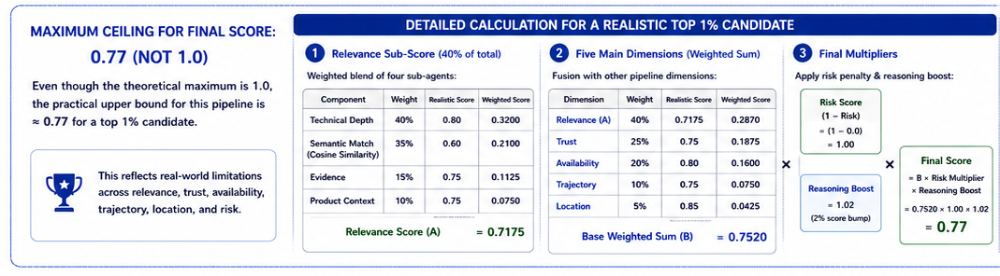
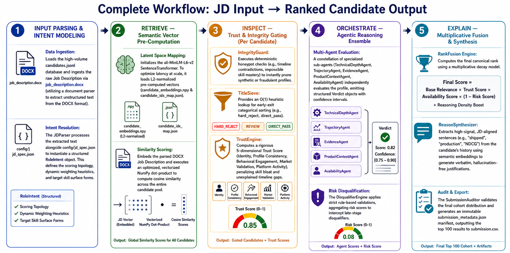

# \*ShortlistIQ — Redrob AI Candidate Ranker

> **Team:** \*ShortlistIQ · **Challenge:** India Runs Data & AI · **Stage:** 3

A multi-signal candidate ranking pipeline that takes a raw `.jsonl` candidate pool and a job description, applies a layered trust-and-integrity filter, multi-dimensional reasoning agents, and a semantic fusion engine to produce a ranked `submission.csv` of the top 100 candidates — all within **5 minutes on CPU**.

---

## Quick Start (single command)

```bash
python rank.py --input candidates.jsonl --output submission.csv --jd job_description.txt
```

> **Pre-computed embeddings are hosted in this repo via Git LFS.** Run `git lfs pull` after cloning (see [Setup](#installation)) to fetch `candidate_embeddings.npy` instantly. With the file in place the ranking step completes in **under 1 minute** on CPU — no pre-computation needed.

---

## Requirements

- Python **≥ 3.11**
- No GPU required — CPU-only inference
- No network calls during ranking — fully offline

---

## Installation

### 1. Clone the repository

```bash
git clone https://github.com/tamajit-ghosh-13/AI-Agents.git
cd AI-Agents
```

### 2. Install dependencies

**Option A — using `uv` (recommended, faster):**

```bash
pip install uv
uv sync
```

**Option B — using pip:**

```bash
pip install -r requirements.txt
```

---

## Pre-Computed Embeddings (via Git LFS)

The `candidate_embeddings.npy` (~150 MB) and `candidate_idx_map.json` files are tracked in this repository using **Git LFS**. You do **not** need to run `precompute_embeddings.py` — just pull the files after cloning:

```bash
# Make sure Git LFS is installed (one-time machine setup)
git lfs install
```

This downloads `candidate_embeddings.npy` in seconds (bandwidth permitting). The ranking step then completes in **under 1 minute**.

> **Fallback:** If Git LFS is unavailable or the pull fails, you can regenerate the embeddings by running:
>
> ```bash
> python precompute_embeddings.py --input candidates.jsonl
> ```
>
> This takes ~30 minutes and is a one-time cost outside the ranking window.

---

## Job Description Input

The ranker accepts the JD as a **plain-text file** (`--jd job_description.txt`).

If you receive the JD as a `.docx` file, convert it first:

```bash
python extract_docx.py --input job_description.docx --output job_description.txt
```

Then run the ranker as normal.

---

## Full Reproduce Pipeline

```bash
# Step 1 — clone the repo and install Git LFS
git lfs install
git clone https://github.com/tamajit-ghosh-13/AI-Agents.git
cd AI-Agents


# Step 2 — install Python dependencies
uv sync

# Step 3 (optional) — convert JD from .docx to .txt
python extract_docx.py --input job_description.docx --output job_description.txt

# Step 5 (<1 min) — produce the submission CSV
python rank.py --input candidates.jsonl --output submission.csv --jd job_description.txt
```

---

## Output Format

`submission.csv` contains exactly **100 rows** with the following columns:

| Column         | Description                                            |
| -------------- | ------------------------------------------------------ |
| `candidate_id` | Unique candidate identifier                            |
| `rank`         | Final rank (1 = best)                                  |
| `score`        | Composite score (0–100 scale)                          |
| `reasoning`    | Human-readable justification prefixed with a fit label |

**Fit label thresholds:**

| Label             | Score range |
| ----------------- | ----------- |
| `[perfect_fit]`   | ≥ 0.75      |
| `[ideal_fit]`     | ≥ 0.70      |
| `[strong_fit]`    | ≥ 0.65      |
| `[good_fit]`      | ≥ 0.60      |
| `[potential_fit]` | ≥ 0.55      |
| `[marginal_fit]`  | ≥ 0.50      |
| `[unlikely_fit]`  | < 0.50      |

**No need for ≥ 80 is because the practical feasible cap for final_score is 77**



---

## Pipeline Architecture

```
candidates.jsonl + job_description.txt
        │
        ▼
┌─────────────────────────────────────────────────────────┐
│  Trust & Integrity Layer                                │
│  • Honeypot detector (experience mismatch, fake tenure) │
│  • Title Sieve (fast early reject for irrelevant roles) │
└──────────────────────────┬──────────────────────────────┘
                           │ qualified candidates
                           ▼
┌─────────────────────────────────────────────────────────┐
│  Multi-Dimensional Reasoning Agents                     │
│  • ID  — Identity & experience depth                    │
│  • CON — Contextual & company-tier signal               │
│  • BEH — Behavioural / achievement depth                │
│  • MKT — Market & recency fit                           │
│  • ACT — Activity & engagement signal                   │
└──────────────────────────┬──────────────────────────────┘
                           │ per-candidate score vectors
                           ▼
┌─────────────────────────────────────────────────────────┐
│  Semantic Fusion Engine                                 │
│  • Embedding similarity (all-MiniLM-L6-v2)              │
│  • Disqualifier hard-gate (DQ1–DQ7)                     │
│  • Weighted score fusion                                │
└──────────────────────────┬──────────────────────────────┘
                           │ ranked list
                           ▼
┌─────────────────────────────────────────────────────────┐
│  Reason Synthesizer + Auditor                           │
│  • Human-readable reasoning statements                  │
│  • Skill inflation detection                            │
│  • Duplicate description flagging                       │
└──────────────────────────┬──────────────────────────────┘
                           │
                           ▼
                     submission.csv (top 100)
```

## 

## Repository Structure

```
redrob_ranker/
├── rank.py                     # 🔑 Main entry point — produces submission.csv
├── precompute_embeddings.py    # One-time embedding pre-computation
├── extract_docx.py             # .docx → .txt converter for JD files
├── requirements.txt            # Python dependencies
├── pyproject.toml              # Project metadata and dependency specs
├── submission_metadata.json    # Hackathon submission metadata
├── candidates.jsonl            # Input candidate pool
├── candidate_embeddings.npy    # Pre-computed embeddings (Git LFS)
├── candidate_idx_map.json      # Embedding index → candidate_id map
├── job_description.txt         # Parsed plain-text JD
├── config/
│   ├── jd_spec.json            # Structured JD spec & scoring weights
│   └── company_tiers.yaml      # Company tier lookup table
└── src/
    ├── auditor.py              # Submission audit & manifest generator
    ├── synthesis.py            # Reason synthesizer
    ├── orchestration/          # Pipeline orchestrator
    ├── retrieval/              # Semantic retrieval & embedding loader
    ├── ranking/                # Disqualifiers, fusion, scoring
    ├── reasoning/              # Per-dimension reasoning agents
    ├── inspection/             # Honeypot & trust checks
    └── query/                  # JD parsing utilities
```

---

## Docker (Sandbox)

A Dockerfile is provided for reproducibility in isolated environments. It includes **Git LFS** so the embeddings file can be pulled automatically.

```bash
docker build -t shortlistiq-ranker .
docker run --rm -v $(pwd):/app shortlistiq-ranker \
  python rank.py --input candidates.jsonl --output submission.csv --jd job_description.txt
```

---

## Compute Constraints

| Constraint           | Value                                          |
| -------------------- | ---------------------------------------------- |
| Platform             | CPU only (no GPU required)                     |
| RAM                  | ≥ 8 GB recommended (16 GB used in development) |
| Network              | **None** — fully offline during ranking        |
| Ranking time         | **< 1 minute** (with pre-computed embeddings)  |
| Pre-computation time | ~30 minutes (one-time)                         |

---

## Declarations

- ✅ No network calls during the ranking step
- ✅ No GPU required for inference
- ✅ Honeypot detection is active and tested
- ✅ All dependencies are pinned in `requirements.txt` and `pyproject.toml`
- ✅ Reproduce command tested end-to-end

---

## Team

| Name          | Role                         |
| ------------- | ---------------------------- |
| Tamajit Ghosh | Team Lead — sole contributor |
